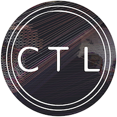

# MediaPipe2Osc

This repository contains MediaPipe2Osc, a modified version of Google's [MediaPipe](https://github.com/google/mediapipe) framework that sends motion tracking data as [Open Sound Control](https://en.wikipedia.org/wiki/Open_Sound_Control) (OSC) encoded datagram packets. This enables landmarks and other tracking information to be used within any OSC compatible environment (e.g. Max/MSP, Python, PD, C++, Processing, you name it, see the [oscexamples](oscexamples/) folder). 


---
# Build Instructions

mediapipe2osc has been tested on OSX (Windows version on the way). These instructions are adapted from the [MediaPipe installation page](https://google.github.io/mediapipe/getting_started/install.html) if you want to try this on other platforms.

Download or clone [mediapipe2osc](https://github.com/tommymitch/mediapipe2osc). 

In a terminal change into the mediapipe2osc folder:
```sh
cd <path to mediapipe2osc>
```
Now install [Xcode](https://developer.apple.com/xcode/) and its Command Line tools:

```sh
xcode-select --install
```

MediaPipe requires [Bazel](https://www.bazel.build/), [OpenCV](https://opencv.org/) and [FFmpeg](https://www.ffmpeg.org/). I'd recommend  installing these with [Homebrew](https://brew.sh/), which can be installed as follows:

```sh
/bin/bash -c "$(curl -fsSL https://raw.githubusercontent.com/Homebrew/install/HEAD/install.sh)"
```
Now install Bazelisk:
```sh
brew install bazelisk
```
and OpenCV, which includes FFmpeg:
```sh
brew install opencv@3
```
There is a known issue with the glog dependency, so uninstall glog:

```sh
$ brew uninstall --ignore-dependencies glog
```
Now build the modified MediaPipe example application:
```sh
bazel build -c opt --cxxopt='-std=c++17' --define MEDIAPIPE_DISABLE_GPU=1 mediapipe/examples/desktop/hand_tracking:hand_tracking_cpu
```
And run:
```sh
GLOG_logtostderr=1 bazel-bin/mediapipe/examples/desktop/hand_tracking/hand_tracking_cpu   --calculator_graph_config_file=mediapipe/graphs/hand_tracking/hand_tracking_desktop_live.pbtxt
```

---
# OSC Dictionary

Landmarks are streamed as UDP datagrams in OSC format on port 8000. 

The OSC address pattern is either `/left` or `/right` for detected hands, and is followed by 63 float32 arguments which are the x, y, z coordinates of the 21 landmarks shown below. 


That is, the 1st, 2nd and 3rd arguments are the `x`, `y` and `z` coordinates of the `WRIST` landmark, etc. For further details see the [oscexamples](oscexamples/).

The `x` and `y` values are in the range `0.0` to `1.0` and represent the position of the landmark relative to the camera image height and width. The `z` value is a depth estimation relative to the wrist and can be -ve.

---
# Info
This project was developed by [Tom Mitchell](https://go.uwe.ac.uk/tom) [@teamaxe](https:twitter.com/teamaxe) with support from: 
- [Bristol and Bath Creative R+D (AHRC)](https://bristolbathcreative.org/)
- [University of the West of England](https://uwe.ac.uk)
- [MiMU Gloves Ltd](https://mimugloves.com/)



